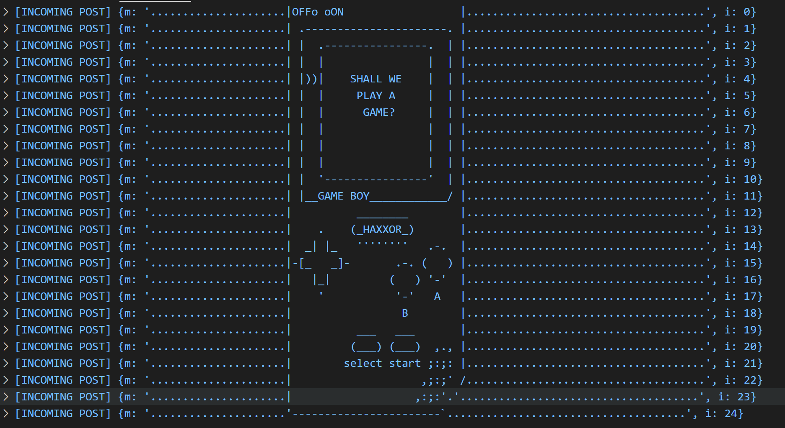

Security Auditing with CSET
-----------
_10/6/2020_

#### Log Everything...?

A common issue faced when building a system which handles anywhere from 1 - 1,000,000 requests at any point in time is noise filtering. 

Prior to announcing an official audit a fun test as an external auditor is to send ascii art requests at random parts of a day to several endpoints. Then start the audit with the simple question of how often does the `SOC` review system logs? Often the answer will be something along the lines of "Everyday..." at which point you can ask to review the logs for anomalies and see the surprise on a SOC Members face when their logs reveal something along these lines... 😱

A log is only as useful as it is reviewed and more important easily queryable... An important guideline for any SOC is to ensure logs objects follow a structured data format. This is not always easy to accomplish however it is instrumental in discovery and forensics. 

#### [Audit Types](https://www.dnsstuff.com/it-security-audit)

- **ISO Compliance:** 
    - The International Organization for Standardization (ISO) develops and publishes an array of guidelines designed to ensure quality, reliability, and safety.
- HIPAA Security Rule: 
    - Protect patient health information.
- PCI DSS Compliance: 
    - Standards responsible for making sure credit card information is protected. Everything from Amazon to Vending Machines
- SOX Compliance: 
    - Protect investors by requiring all public companies to provide accurate, reliable financial disclosures on an annual basis.

#### [SolarWinds](https://www.solarwindsmsp.com/)

[SolarWinds](https://www.solarwindsmsp.com/) is an industry leader in threat detection, analysis, and reporting. They make many amazing tools that can be used to enhance any SOC Team Toolbelt.

