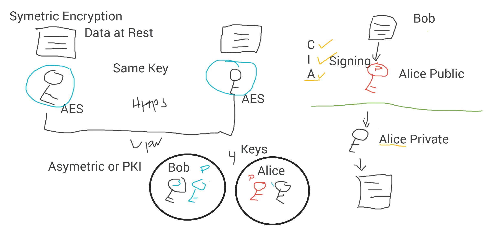

Public Key Infrastructure
-----------
_10/15/2020_

Public Key Infrastructure (PKI) is a technology for authenticating users and devices in the digital world. The basic idea is to have one or more trusted parties digitally sign documents certifying that a particular cryptographic key belongs to a particular user or device. The key can then be used as an identity for the user in digital networks.

PKI is setup using a pair of keys. The basic concept is made up from a `public key` and a `private key`. The most common way a pair of keys works is to have data encrypted with a the intended recipients public key, once the recipient receives the ciphered data they can decipher it using their own private key. A large misconception arrives when people think of PKI as only one set of keys when in reality to pull off any form of meaningful communication recipients need the ability to respond. To do so they must follow the exact same process only in reverse for they are now the sender and their recipient must have their own pair of public and private keys. 

HTTPS vs Wireshark
Wireshark is a common tool used in man in the middle attacks as it will allow an individual to see all of the packets being sent across a network. If the message is not properly encrypted then the attacker can simply read all of the data transferred between a client and host.

PKI is used in generating and issuing SSL certificates. SSL (Secure Sockets Layer) is the security protocol used on the web when you fetch a page whose address begins with https:. TLS (Transport Layer Security) is a newer version of the protocol. In practice, most websites now use the new version. With HTTPS, certificates serve to identify the web site you are connecting to, to ensure that no one can decipher encrypted traffic between a client and host. Certificates and cryptographic authentication of the server prevent man-in-the-middle attacks from successfully reading data from a compromised network.

