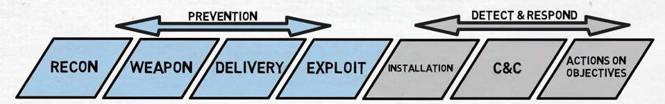
Threat Analysis, Cyber Kill-Chain, and STUXnet
-----------
_10/25/2020_

### Cyber Kill-Chain

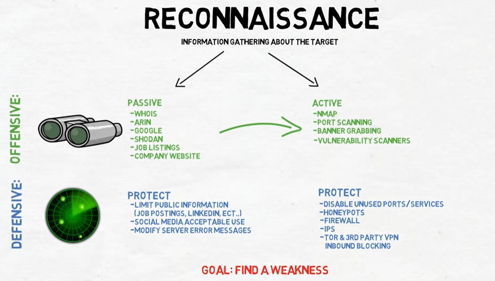

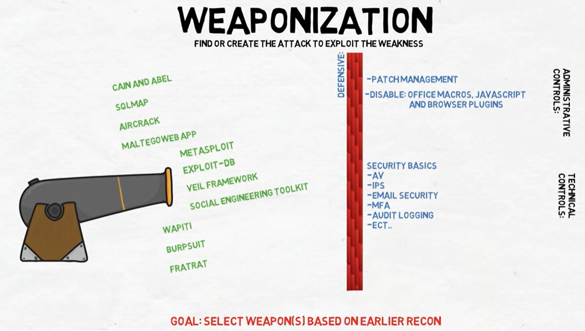

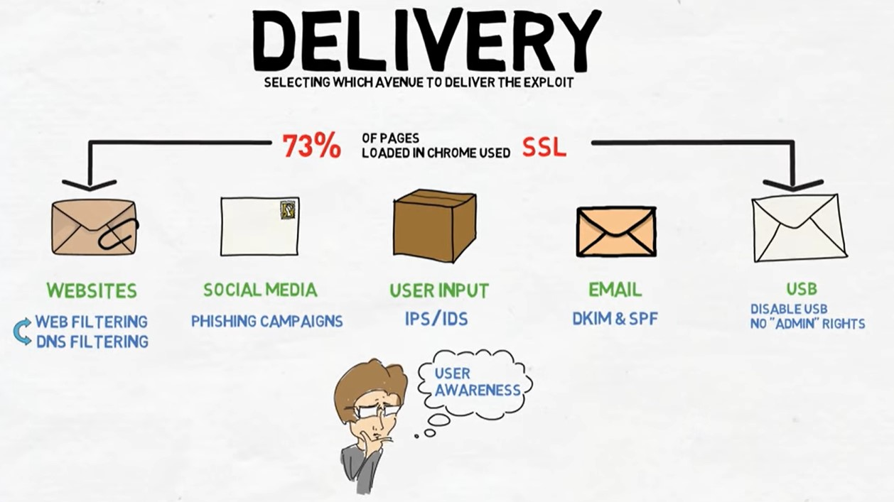

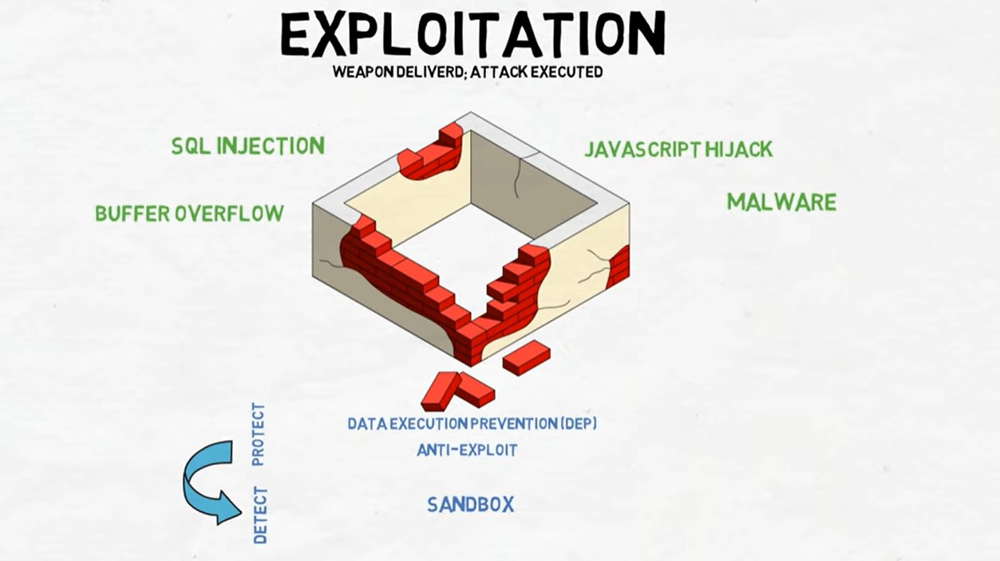

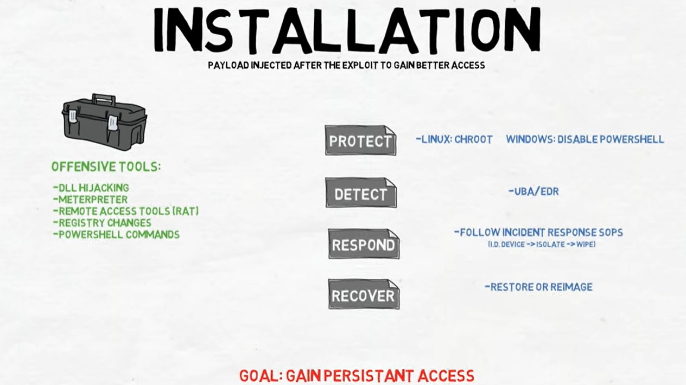

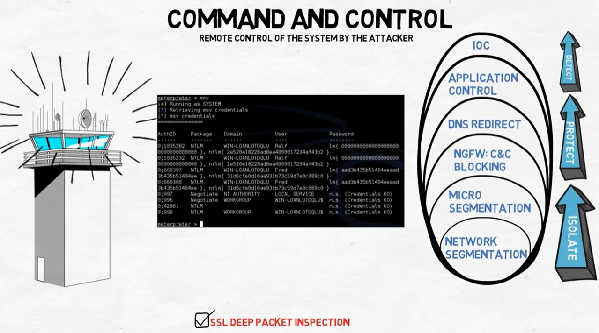

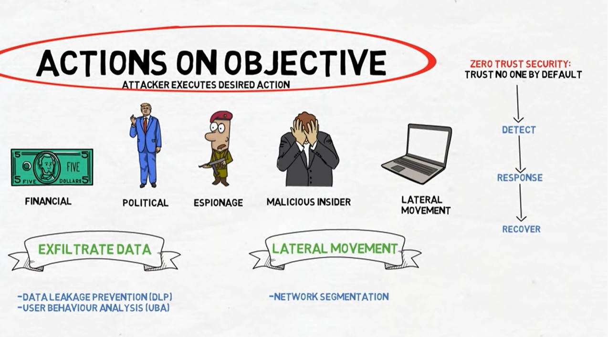

### Breaking the Chain

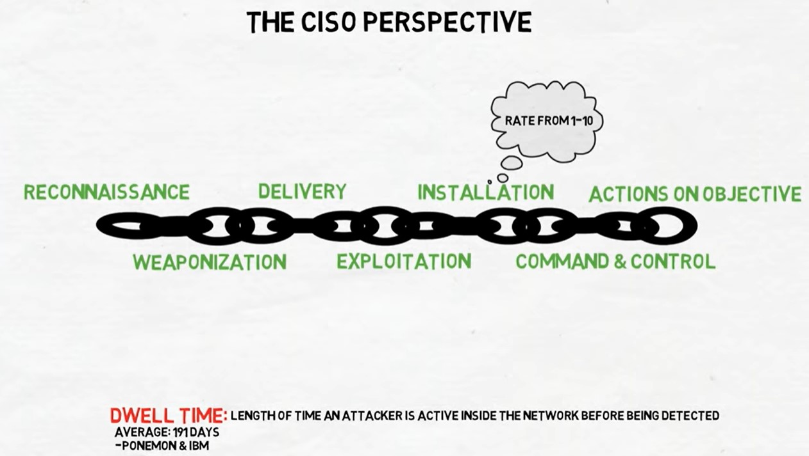

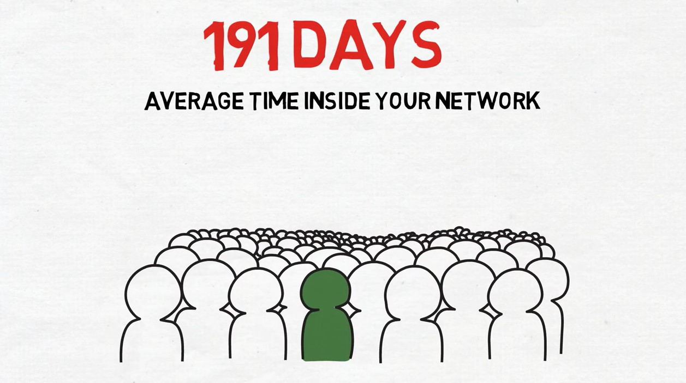

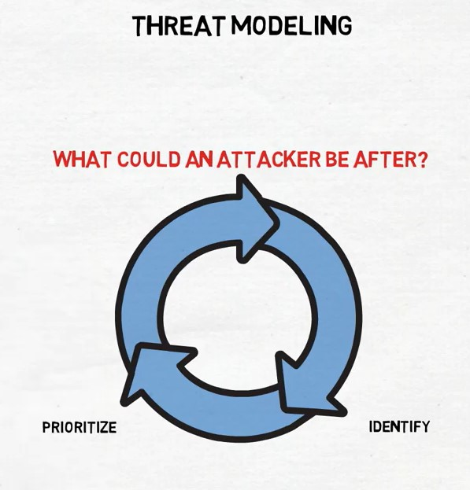

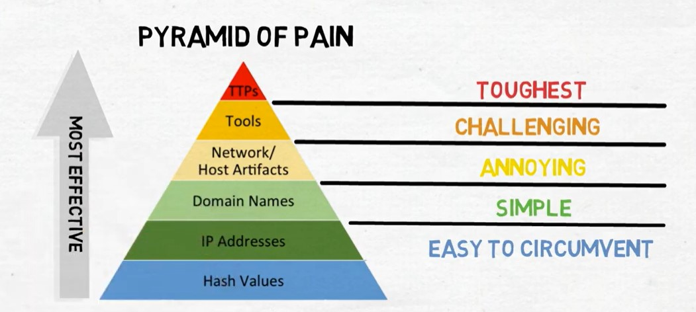

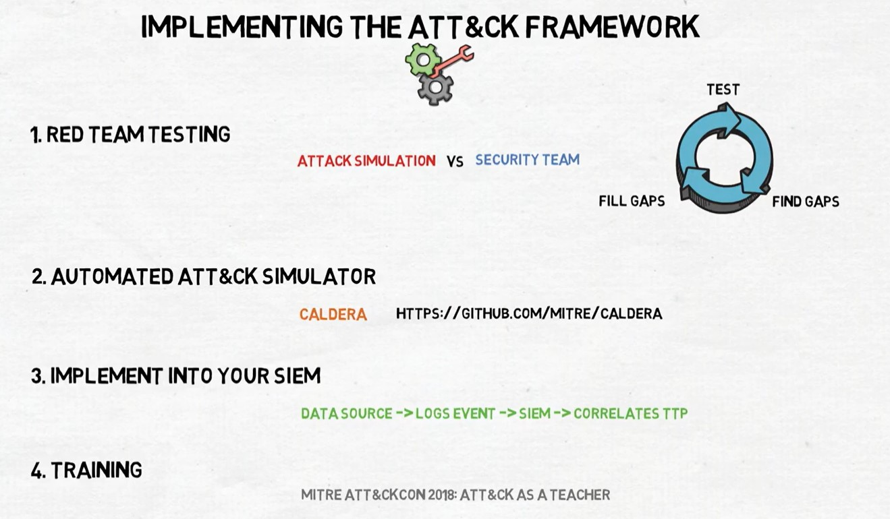

---

### STUXnet Example

> Never trust a usb drive

Operation Olympic Games was a covert and still unacknowledged campaign of sabotage by means of cyber disruption, directed at Iranian nuclear facilities by the United States and likely Israel. As reported, it is one of the first known uses of offensive cyber weapons. Started under the administration of George W. Bush in 2006, Olympic Games was accelerated under President Obama, who heeded Bush's advice to continue cyber attacks on the Iranian nuclear facility at Natanz. Bush believed that the strategy was the only way to prevent an Israeli conventional strike on Iranian nuclear facilities.

