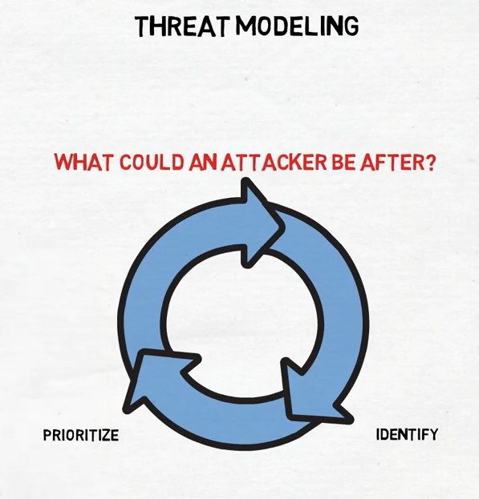

Web Application Threat Modeling with OWASP, DREAD
-----------
_10/26/2020_

> Threat modeling: the sooner the better, but never too late.

Most bugs are put into production through Development. OWASP recommends to bring Security and Development teams together to collaborate on a shared understanding to identify threats, compliance requirements, and evaluate risk
to build required controls.

#### Threat Modeling Considerations

1. What are we building?
    - Architecture diagrams
        - Do we need it?
    - Dataflow transitions
    - Data classifications
2. What can go wrong?
    - STRIDE 
    - Kill Chains 
    - CAPEC
3. What are we going to do about that?
    - Contextualise the risk
    - Weight risk vs value
    - Agreement & Tagging
    - Fix Implementation
4. Did we do a good enough job?
    - Retrospective 
        - Check quality, feasibility, progress
        - Test Test Test 
