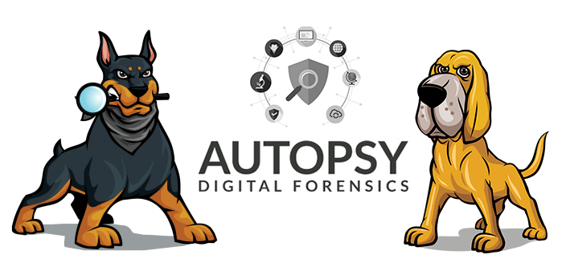

Forensics Investigation with Autopsy
-----------
_11/19/2020_

> These days, cyber criminals seem to be everywhere. They lurk in the darkest corners of the internet, defrauding people, hacking, stealing, and hiding from authorities with virtual anonymity. Cyber Criminals are wreaking havoc by unleashing ransomware attacks, stealing data, even disrupting day-to-day government operations. **It's time to stop them.**

## Digital Forensics in Cyber Security

Cyber security professionals are on the front lines in the fight against cybercrime. They are the people who collect, process, preserve, and analyze computer-related evidence.
These professionals help identify network vulnerabilities and ways to mitigate them. They go deep inside networks, computers, and smartphones in search of evidence of criminal activity, and run counterintelligence against criminals.

Cyber security professionals are highly trained and skilled with a deep understanding of computers, networks, and coding. The professional possesses in-depth investigative abilities, critical-thinking skills and analytical talent. The ability to effectively communicate and work with a wide range of people is an absolute must. These professionals have a firm belief and moral compass in upholding and enforcing the law. 

Application and investigation of digital forensics enables the professional to extract the evidence needed to trace identify and ensure justice against cyber criminals. Often times the evidence needed is hidden deep within a computer or network frequently it has been deleted by the suspect in an attempt to cover their tracks. It's the job of these professionals to use their knowledge and skills to uncover the truth, by reconstructing hidden data or piecing together individual keystrokes into incriminating messages and search terms. These professionals can and do make a measurable difference in the individual lives of people around the world.

The professionals who work in the industry have helped catch people dealing in illegal pornography. They have helped bring killers to justice. They've tracked terrorists, located missing people, and found otherwise ordinary employees who were stealing millions of dollars.

## Autopsy

Autopsy is the premier open source forensics platform which is fast, easy-to-use, and capable of analyzing all types of mobile devices and digital media. Its plug-in architecture enables extensibility from community-developed or custom-built modules. Autopsy evolves to meet the needs of hundreds of thousands of professionals in law enforcement, national security, litigation support, and corporate investigation. Autopsy can be used to uncover and restore the evidence law enforcement professionals need to bring cyber criminals to justice. 

Here is a great guide to get started with autopsy [https://datascience.foundation/sciencewhitepaper/an-overview-of-autopsy-open-source-digital-forensic-platform-1](https://datascience.foundation/sciencewhitepaper/an-overview-of-autopsy-open-source-digital-forensic-platform-1)
